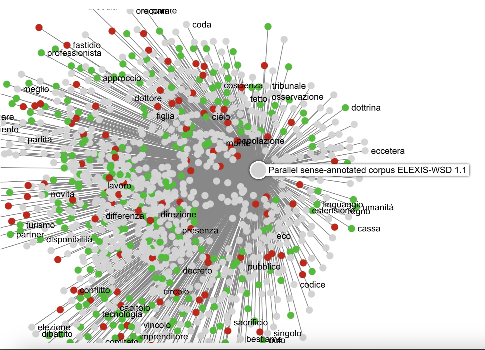

# Overview of CIRCSE's "CLARIN Textual resources linker"

## The demo

The webpage showcasing the actual status of our prototype on Italian of the "CLARIN Textual resources linker" can be accessed at: http://lila-erc.eu:8080/CLARIN_vlo_linker/

## The tool

The "CLARIN Textual resources linker" is a prototype of a service that aims at:
1. inducing a collection of lemmas for any given language via automatic lemmatization of corpora in CLARIN, where each lemma is identified with a unique ID and part-of-speech (POS) tag;
2. visualizing and browsing the network created by textual resources published in CLARIN and the lemmas.

In this pilot project, we designed the tool to be not only language independent, but also as agnostic to formats used to distribute corpus data as possible. Moreover, we wanted the software to work with the most general and easily accessible CLARIN tools (like the VLO) and for it to require the minimum input from humans.

The language of the source texts to be indexed is given as a parameter to the scraper component of the backed (see [below](#the-backend)) and the appropriate lexical resources and lemmas found are then entered in a [database](#the-database-structure). The CLARIN Textual resources linker works by automatically annotating (with lemmatization and POS-tagging) the collected resources, and uses the generated lemmas as a linking device, without any manual intervention by human curators (which is, of course, always possible, if this is desidered).

The tool is made of two components: a [backend](#the-backend) and a [frontend](#the-frontend) which is used to visualize the data. The rationale and functioning of both compoments is explained in the next sections.

### The backend

The backend component takes care of scanning the textual resources in CLARIN, harvesting the full texts of the textual resources, and creating the database of lemmas and occurrence indexes that are used by the [frontend](#the-frontend).

The backend is conceptualized as a pipeline of different services, described in the next paragraphs.

#### Crawler

This component scans the CLARIN's Virtual Language Observatory ([VLO](https://vlo.clarin.eu)), browsing the resources registered as textual corpora for the language passed as agument. The aim of this tool is to obtain the list of URLs from which the full textual content of the corpora can be downloaded. 

As the VLO does not provide an API to programmatically search the collections, in this exploratory project we implemented this component as a web crawler (written in JavaScript) that reads the web pages of the observatory and extracts the link to the XML file containing the complete metadata description (e.g. [this](https://vlo.clarin.eu/data/clarin/results/cmdi/ILC_CNR_for_CLARIN_IT_repository_hosted_at_Institute_for_Computational_Linguistics_A_Zampolli_National_Research_Council_in_Pisa/oai_dspace_clarin_it_ilc_cnr_it_20_500_11752_OPEN_548.xml) file for the [Cretan Institutional Inscriptions Dataset](https://vlo.clarin.eu/record/https_58__47__47_hdl.handle.net_47_20.500.11752_47_OPEN-548_64_format_61_cmdi?2&fqType=languageCode:or&fq=languageCode:code:ita&fqType=resourceClass:or&fq=resourceClass:corpus&fq=resourceClass:dataset&index=48&count=203)). From that source, the crawler collects the addresses where the full text of the corpora can be downloaded.

This work is complicated by the fact that not all resources indexed choose to provide a direct link to download the materials, even when they are distributed under open licenses. Also, a more efficient way to scan the resources should be indentified (perhaps via the CLARIN's [OAI-PMH endoints](https://centres.clarin.eu/oai_pmh)?). An API to programmatically access the metadata of the VLO would be a considerable help for projects like ours.

#### Text extractor and analyzer

A Java application takes the URL list provided by the crawler, and inspects the downloadable content for each of them. Textual content in a handful of format (plain text, XML, CSV, TSV) is parsed right away. Archive in targz, zip and bz format are scanned for files in the parsable formats, which are then extracted.

The textual content is further analyzed by a language detection software, to ensure that, in case of multilingual or parallel corpora, only the parts in the target language are kept. The output text is then processed using UDPipe (version 1: see [below](#limitations)) and the appropriate model for the target language (in case multiple models are provided, the one trained on the largest corpus) is selected.

The lemmatized output is used to compile the appropriate tables in the backend [database](#the-database-structure). The lemma-POS tuples, which are not already present, are entered in the lemma table; at the moment, we restrict the entries to the open classes for content words (verbs, nouns, adjectives and adverbs). The occurrences of each lemma is recorded in an approriate entry in the lemma/lexical resource table.

CoNLL-U and CoNLL files from [manually annotated corpora](https://www.clarin.eu/resource-families/manually-annotated-corpora) are currently not scanned. As they already provide gold data, they would require special treatment, since they are ready to be included as they are, with their manually assigned value of lemma and POS. To create our prototype, on the other hand, we chose to focus only on the most basic workflow, from raw texts to linked resources.

#### The database structure

The image above reproduces the structure of the database with the tables generated for Italian. In particular, note that:

* lemma/POS couplets produced by in the annotation step are entered in the `it_lemmaBank` table;
* the frequency of each lemma in all the indexed resources is recorded in the table `it_resource_lemma`;
* the URLs, names and other metadata of the indexed corpora is found in the table `it_resource_descriptor`;
* in our demo, we index the content of only one lexical resource for Italian, [OpeNER sentiment lexicon](http://hdl.handle.net/20.500.11752/ILC-73); however, we do not yet index the entries with the ID of the lemmas;
* we plan to support also keyword extraction from the corpora, but at the moment we could not implement this step effieciently (see [below](#future-plans-and-to-dos)); the `it_keyconcepts` table is therefore empty.

Currently, the database index 82,442 lemmas and 14 textual resources for Italian. A dump of the database is available for offline exploration in [data/CLARINDB.sql.tar.gz]('../../../data/CLARINDB.sql.tar.gz'). Some python code to work with the DB data is also visible in our [Jupyter notebooks]('../../../code/notebooks/').

### The frontend

The frontend display the network created by lemmas and textual resources, as recorded in the project's [database](#the-database-structure). 

By defauld, the [demo](http://lila-erc.eu:8080/CLARIN_vlo_linker/) shows the network created by nouns and textual resources. It is possible, however, to switch to the adjective- or verb-based graph by selecting the appropriate entry in the `Lemma type` field of the menu bar. The network already appears very dense, and yet the visualization is arbitrarily limited to those words of the three classes that appear in a range of +/- 1 standard deviation from the mean frequency. More informative criteria for selecting the lemmas included in the network, or tools to increase/decrease the number of nodes such as slide selectors, will be implemented in future releases.

By hovering over a node, users can focus on a specific lemma. The image above, for instance, shows the occurrences of the noun *grandezza* (greatness) in the 6 corpora where it is attested. Note the different colors used for the resource nodes. These colors are automatically assigned using [Gephi](https://gephi.org/)'s implementation of the [Louvain method](https://parklize.blogspot.com/2014/12/gephi-clustering-layout-by-modularity.html) to calculate the network [modularity](https://en.wikipedia.org/wiki/Modularity_(networks)). The colors thus correspond to the different groups identified by the clustering algorithm. They identify, that is, groups of resources that, on account of their pattern of relations to lemmas, form more or less isolated areas within the general network.

Lemmas can also be selected from the text field in the main menu on the top of the page. If users select once again the lemma *grandezza* they will find a visualization like the one in the figure above. In this case, the nodes are no longer colored according to their modularity class, but the nodes are re-arranged so that the distance of the corpora from the center (the selected lemma) becomes proportional to the absolute frequency of the attestations. In this example, the [It-Sr-NER](https://hdl.handle.net/20.500.11752/OPEN-981) corpus, with its 28 occurrences of *grandezza*, is considerably closer to the selected lemma than the [PoliModal Corpus](https://hdl.handle.net/20.500.11752/OPEN-534) or the [COMIC](https://hdl.handle.net/20.500.14106/2426) corpus (1 occurrence for each).

After clicking on a lemma node, a box in the right-hand side also shows the list of corpora where the word is attested. Selecting a corpus node, on the other hand, will display the list of the lemmas of the selected class (nouns, adjectives or verb) associated to it.

The menu bar on the top also includes a switch to activate a visualization based on the content of the only textual resource that we incorporate so fare (the OpenNER sentiment lexicon). OpenNER is thus an example of how lexicons can be used to provide access or to interact with the network. By activating the switch, the color of the lemma node is changed according to the polarity value recorded in the dictionary (red for negative words, green for positive, light grey for neutral).

The image above visualizes the network for the nouns in the [Parallel sense-annotated corpus ELEXIS-WSD 1.1](https://hdl.handle.net/11356/1842), classified according to their polarity value in OpeNER.

## Limitations

The current demo is limited to **one language** (Italian) and a narrow selection of 14 textual resources. As said, we tried to design the tool to work with an unsupervised and language-independent workflow. This workflow is portable and guaranteed to work for any language that have corpora, lemmatizers and trained NLP models for lemmatization/POS tagging, but is extremely costly in terms of computational resources. Both back- and frontend require a lot of computational power to work at the full scale of CLARIN (or even a single high resourced language in it): the indexing and processing performed by the back-end component has to deal with texts in various formats and often of several gigabyte in size; the frontend has to generate the visualization of a dense network dynamically, by also performing calculation like modularity.

The limited resources we were working with in term of computer power forced us to keep the demo restricted to a small subset of corpora and one single language.

## Future plans and TO-DO's

CLARIN's **Resource Families** for corpora are a great way to classify textual resources that can be integrated into our network visualization. Much as we use colors to visually distinguish lemmas or corpora, we can use specific colors to show the distribution of the textual resources in CLARIN's **Resource Families**. For instance, network nodes representing corpora included in the family [Corpora of Academic Texts](https://www.clarin.eu/resource-families/corpora-academic-texts) may be colored in blue, while the resources in [L2 Learner Corpora](https://www.clarin.eu/resource-families/L2-corpora) may be in read, and so forth.

Our original plan was also to add a keyword extractor to the pipeline of the [backend](#the-backend), so that users could also browse our network starting from key concepts. Our idea was to link keywords and keyphrases to the lemmas in the extracted lemma bank, so that, if e.g. the phrase "unemployment rate" was recognized a a key-phrase, it would have been linked to both the lemmas "unemployment" and "rate". For Italian, we made experiments using [Keyphrase Digger (KD)](https://dh.fbk.eu/2015/12/kd-keyphrase-digger/). Unfortunately, we were unable to add this visualization to our demo, for the same technical [limitations](#limitations) that we have already discussed. The idea of using keywords and keyphrases to index resources is however still potentially very interesting, as it would give prominence to those words that are statistically identifiable as specific to each corpus.

The demo only includes one lexical resource, but much more advanced access and more interesting avenues for corpus exploration can be opened if more lexicons are added, with more layers of semantic information. Other polarity and sentiment lexicons can be added to provide the same type of information as OpeNER. Moreover, although the network is already dense (and demanding in terms in computational resources), other classes of nodes can be added to the network, introducing concepts taken from lexical resources. Given the number of WordNets dictionaries in the VLO for many language (see our [survey](../doc/survey.md) of lexical resources), one example might be WordNet synsets. Our visualizaton can thus be used to display a network of relations between lemmas, corpora and synsets.

As for the quality of the data that our tools produced, the automatically harvested lemma bank is certainly not 100% accurate. One has only to look at the list of lemmas in the DB or in the online demo to see that many non-existing words were included as part of the Italian lexicon (e.g. *aastano* or *abinõud*). We have designed our tool to be as independent from human intervention as possible. Lists of lemmas harvested with such an automatic workflow can (and should) be improved in 2 possible ways:

- by manual curation;
- by cross-checking with lexical resources (which may also yield many additional lemmas).

The result of this semi-automatic work of harvesting/curation should be returned to CLARIN, ideally in the form of LLOD (such as those that we produced as [output](https://github.com/CIRCSE/CLARIN_L2L/blob/main/data/rdf.zip) of our project), so as to keep the number of what we have identified as ["5-star" lemmatization data](https://github.com/CIRCSE/CLARIN_L2L/blob/main/doc/survey.md#lod-compliant-lexical-resources) growing! 
